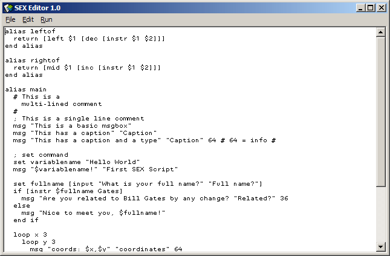



## Scripting Engine X \(SEX\)

### Description

Update of my scripting engine

Now supports if/elseif/else, while loops, loop loops, arrays of variables, formula evaluation (i got the code from here, but cant remember from who, but ill find and give them credit, i promise, sorry to that person). All of the above can be nested, along with the functions.

You can EASILY add very little code to make it open a console window and do input and output. I didn't add that because it's purely an engine so far.
 
### More Info
 

             |
---                |---
**Submitted On**   |2001-10-13 03:36:52
**By**             |[vcv](https://github.com/Planet-Source-Code/PSCIndex/blob/master/ByAuthor/vcv.md)
**Level**          |Advanced
**User Rating**    |5.0 (30 globes from 6 users)
**Compatibility**  |VB 6\.0
**Category**       |[String Manipulation](https://github.com/Planet-Source-Code/PSCIndex/blob/master/ByCategory/string-manipulation__1-5.md)
**World**          |[Visual Basic](https://github.com/Planet-Source-Code/PSCIndex/blob/master/ByWorld/visual-basic.md)
**Archive File**   |[Scripting 2882110132001\.zip](https://github.com/Planet-Source-Code/vcv-scripting-engine-x-sex__1-28040/archive/master.zip)

